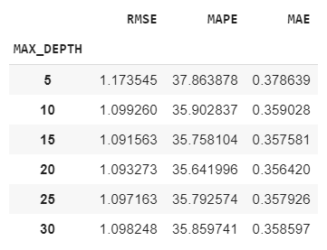

## Sentiment Analysis/Prediction for Rebtel Comments on TrustPilot.com

### Summary

Under the scope of this project, firstly a comment scrapper script was developed to collect customer comments and ratings from trustpilot.com about Rebtel App, which allows to make cheap international phone calls. Then various text cleaning and preprocessing operations were applied to collected data and 4 different sentiment prediction models were created. The hyper-parameters and the models validated by using the 5-folds cross validation method. Finally the most successful model was wrapped with a python flask rest service and containerized with Docker as a production ready scalable stateless web-service. In the following sections details of the operations above is explained. Please refer to Technical Details section for other information such that project structure, docker container run configuration, swagger and api paths.

### Assumptions

Due to time considerations and efficiency requirements, some assumptions are made.

During the dataset collection from trustpilot.com, only English comments were gathered because of the extensive NLP library and pretrained word embedding support. Comments are classified by the trustpilot.com with respect the their languages and correctness/completeness the of that classification was an another assumption.

All punctuation marks (except emoticons) and stop words are ignored to speed up training time and reduce word embedding dictionary sizes. Non-alpha numeric words and the words, that contain single character, were ignored.

Collected dataset is imbalanced and to improve prediction performance, by assuming the instances are  diverse enough, instance count of the classes were equalized via existing item duplication. More intelligent data augmentation techniques would produce better results.

Title sections of the comments were ignored since they repeated on content.

### Data Scrapping

 In order to collect data from trustpilot.com, python&#39;s &quot;_requests_&quot; http client and &quot;_BeautifulSoup_&quot; html processing libraries were employed. Comments exist in &quot;review-card&quot; classed html &quot;div&quot; elements in the pages of trustpilot.com. Thus firstly, &quot;_review-card_&quot; classed &quot;_div_&quot; elements were extracted from the every page of Rebtel comments. Then for each &quot;_review-card_&quot;, sub-sections of the review; rating, title and content were extracted. These sub-sections are in &quot;_star-rating star-rating--medium_&quot;, &quot;_review-content\_\_title&quot;_ and &quot;_review-content\_\_text_&quot; respectively.

By increasing the page number from one to inifinity, comments were collected from the following link ([https://www.trustpilot.com/review/www.rebtel.com?page={page\_nums}](https://www.trustpilot.com/review/www.rebtel.com?page=%7bpage_nums%7d)). To determine the last valid comment page,  http response codes were utilized. Trustpilot.com returns Http 301 &quot;redirect&quot; response in case of an invalid page request.

Finally 4111 comments were collected from trustpilot.com and the score/rating distribution of these comment are depicted in below.

 

### Preprocessing

Following text preprocessing operations were applied to collected comments before feeding prediction models with them. These preprocessing operations aim to improve prediction performance of the prediction models.

- All sentences were made lower case.
- Special character sequences which correspond to positive and negative emoticons were replaced with &quot;_positive_&quot; and &quot;_negative_&quot; words respectively
- Remaining special characters and punctuation marks were removed
- English stop-words were removed.

### Feature Generation

Preprocessing on text based comments is not enough solely to give them to prediction models. Text based data need to be digitized. To this end two different text digitization/vectorization method were tested and used. The results can been seen on Model Development section.

  #### Word2Vec Based Feature Generation

Word2Vec model is a method that produce similar embedding vectors for the word which are exist mostly in same context or near neighborhood. 3 word2vec approaches were tested for this project:

  - Using a word2vec model that was trained on Rebtel dataset
  - Using a pretrained (GoogleNews-vectors-negative300) word2vec model
  - Using a fine-tuned (Rebtel) version of pre-trained (GoogleNews-vectors-negative300)  word2vec model

Most successful prediction results were obtained by employing fine-tuned version of pre-trained word2vec model.

In order to find sentence vectors of each comment, arithmetic mean of word vectors of the comment was computed.

   #### TF.IDF Based Feature Generation

TF.IDF approach is one of most frequently used feature extraction methods for conventional natural language processing tasks. It tries to find appropriate weights for word importances according to their in-document and inter-document frequencies. This method also produced promising results especially for short comment sentences.

### Model Development

3 different methods were tested as prediction model.

   #### Classification Based

In this approach, the problem was threaded as multi-class classification problem [1,2,3,4,5].

The dataset is small and imbalanced also there is a possible risk of overfit. By considering these factors, it was thought than an ensemble based non-linear model would be useful. To this end Random Forest classification algorithm was selected and fed with TF.IDF and W2V features independently.

   #### Regression Based

Since labels of comments are numeric and their orders magnitudes are meaningful, the problem seen as a regression problem. Again by considering factors which are stated above, Random Forest Regressor model was selected as an ensemble based non-linear model. Fed with TF.IDF and W2V features independently.

Regression based model produced better results in terms of error rates.

   #### Regression Based Model Ensemble (TF.IDF + Word2Vec)

Error rates of word2vec features are lower than TF.IDF ones. On the other than TF.IDF feature exposes better results on short sentences. To combine their advantages and produce more robust model, 2 different Random Forest Regressor model was trained with TF.IDF and Word2Vec features respectively. Than an ensemble created by taking the arithmetic mean of their prediction scores.

This approach produced the lowest error rates in terms of MSE values.

### Model Validation

The robustness of the classification and regression based models were validated with 5-folds cross validation technique. To this end, the whole dataset partitioned into 5 parts by stratified random sampling. For each part 80% percent of the data was used for training and 20% percent was used for test.

Hyper-parameter analysis was also made in cross-validation. Applied prediction models have many numbers of parameters. Due to the time considerations, only the most important parameter, Max Tree Depth in this case, has analyzed. The results are shown in below;

Results for classification based model (Features: Fine-tuned, pre-trained w2v model):

 

Results for regression based model (Features: Fine-tuned, pre-trained w2v model):

 

Results for classification based model (Features: TF.IDF model):

 

Results for classification based model (Features: TF.IDF model):

 

To create a baseline, collected dataset is also tested with Vader method which is a well-known rule based sentiment analysis technique. Results of the Vader method is in below.

 

According to RMSE and MAPE metrics, proposed methods much more better than baseline Vader method.

### Containerization &amp; Bringing into Production

Developed sentiment analysis model ensemble, wrapped with a Python Flask based rest service and packaged as a Docker container image. This image includes required python dependencies besides rest service and model binaries.

Sentiment model's docker image is a stateless, scalable web application and it can be useful to run it with a container orchestrator such that Kubernetes and Mesos for production environments. Please refer to Technical Details section for Docker container build and run commands.

### Possible Improvements

In order to reduce error rates and improve product quality, several improvements can be done;

- Prediction accuracy would be improved by using more recent better word embedding techniques such that Elmo, Bert and XLNet. Since they relatively new, library support of these techniques are limited than word2vec and they require bigger datasets.

- To support other languages, other pre-trained models of word2vec would be integrated with the system.

- Applying the same hyper-parameter optimization for other hyper-parameters would produce better prediction models.

- In order to provide separate environment for data scientist and software engineer; the programming logic of rest service and the model can be decoupled as separate units. To this end; rest service would be programmed as to download model&#39;s python code and binaries as a package from a model repository such as Hdfs, NoSQL Db, or even a Gitlab for versioning. This architecture also enables to load model dynamically to the rest api without interrupting the service.

### Business Implications and Possible Usecases

This project can be used for these potential usecases

- The tweets which contain #rebtel tags can be fetched from twitter in a streaming fashion, and brand perception analysis can be done by using this app.

- Support center would also be an another usecase such that, messages that sent to support center can automatically be analyzed with this app. The messages, whose predicted scores are in below a predefined threshold, can be redirected to support department with high priority.
- The effects of the newly added features on customer feelings can be discovered and better features can be developed.

- Most frequent and important words most negative and most positive comments can be extracted and based on these words quality of the product can be improved. Currently the important words which are in below are taken from Random Forest Model&#39;s  most decisive features (highest predictive power).

Most decisive words for of lowest scored (1) comments
 

According to these results; in most negative comments, customers mainly complain about money related terms such as &quot;refund&quot;, &quot;bank&quot; and they also think that they defrauded.

Most decisive words for of highest scored (5) comments
 

According to these results; in most positive comments, customers mainly appreciate service quality an ease of use.

### Technical Details

   #### Project Structure
   /api/ : Includes model binaries, flask rest service, model utilities and dockerfile
   /data\_scrapper/ : Includes data set collection script for trustpilot.com
   /experiments/ : Includes Jupyter notebook file that contain all cross validation and model development related experiments.
   /requirement.txt : Includes python package dependencies

   #### Docker Build
   In order built docker container please run the code in below where you /api/ directory
   ```
   docker build -t rebtel_sentiment
   ```
   
   #### Docker Run
   In order to run pre-built docker container, plesase run the code in below
   ```
   docker run --name rebtel_sentiment -p 5555:5050 rebtel_sentiment
   ```
   The rest service accepts request over 5555 port. If it is not available on the system, any different port can be used.

   #### Swagger Api Documentation
   Swagger api documentation UI of the prediction service can be accessed from the path in below
   [_http://localhost:5555/api-docs_](http://localhost:5555/api-docs)

   #### Prediction Api
    Prediction api can be accessed over /api/execute path with a Http Post request. As it shown the Swagger api documentation UI in below:

   
